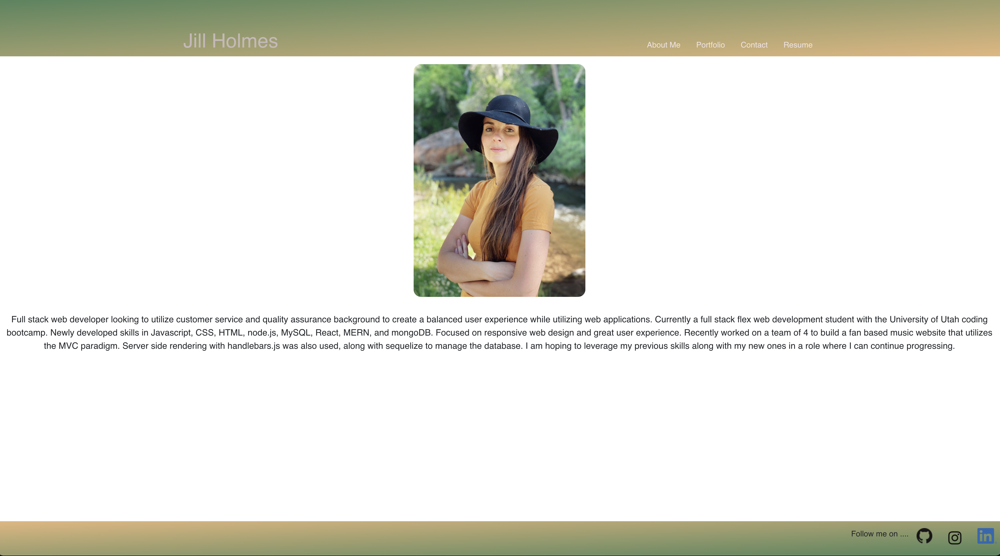

# Jill Holmes React-Portfolio

  
  
  ## Table of Contents
  -[Project Description](#projectDescription)
  -[Table of Contents](#tableofContents)
  -[License](#license)
  -[Questions](#questions)

  ## Project Description 
  This is an online portfoliio made to showcase my work to potential employers and collaborators. It is primarily built in React. 

  Check out my portfolio here!
  https://jillium.github.io/its-me/

  
  
  
  ## Languages Used 
  Javascript,CSS,HTML,Other

 

  ### What will the app be used for? 
  This is used as an online portfolio for potential employers to see my work, and for collaborators to see what I have done. 

 

  ### License
  This application is covered under the Open license
  

  ### Questions
  -------------------------------------------------------------------------------------------------------
  
  Check me out on Github!: (https://github.com/Jillium) 
  
  Any questions? Email at holmesjillanne@gmail.com

This project was bootstrapped with [Create React App](https://github.com/facebook/create-react-app)

